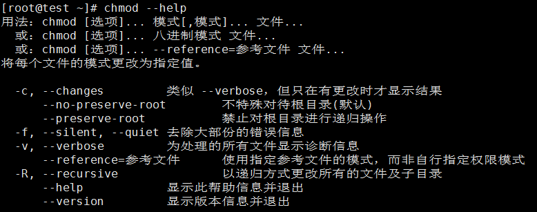
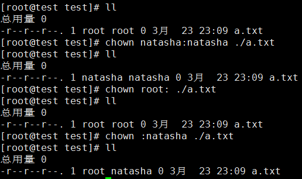
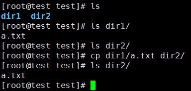
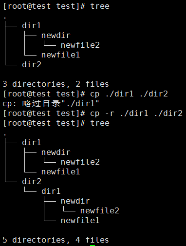
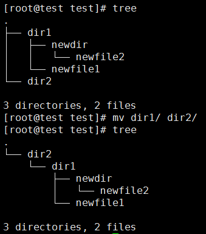
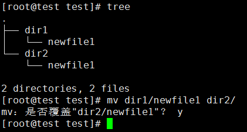
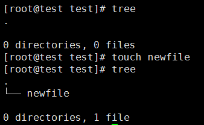
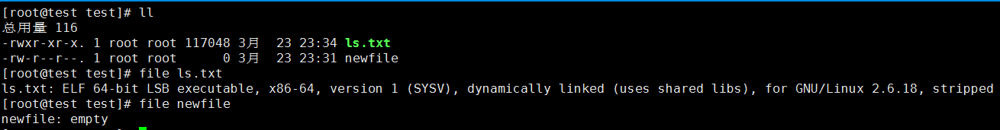
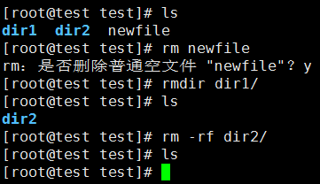

# Linux基础知识
## 1.SSHD服务
对于Linux主机的操作，除去直接通过管理口来进行操作意外，大多数的操作方式都是通过SSHD服务进行访问。

如图我们可以看到默认的ssh服务，默认绑定端口22。用户可以通过提供该系统中的用户名和密码进行登录。

## 2.首次登录
在成功登录之后，你会看到如下的画面：

其中的部分进行解析，首先第一个红色框表示的是你当前所连接的主机以及通过的端口；第二个红色框表示的是你上一次登录的时间以及登录的IP地址；第三个框所代表的是当前登录的相关信息。关注@符号的左右侧，左侧为当前你登录的用户，如图显示我所登录的用户是root用户，右侧为当前Linux主机的主机名。在这之后的字符，表示当前你所在的目录，~符号代表当前你所在的目录在当前用户的家目录下。每次用户登录的时候，都会将你的当前目录切换到该用户的家目录下。普通用户的家目录默认在/home/下，例如你登录的用户是QbDev，则你的家目录是/home/QbDev。如果你是root用户，则你的家目录是/root。
在中括之后有个符号#，#符号代表你当前使用的是超级用户权限来操作系统。如果是普通用户，则符号为$号，代表你当前
在使用普通用户权限来操作系统。而在这个符号之后，则是我们输入命令的地方。

## 3.Linux命令
  Linux的命令主要由三部分组成。Command命令 Options选项 Argument参数。例如命令ls -l /root。这条命令中Command为ls;Options为-l;Argument为/root。当然在一条命令中，选项与参数并不是必须的，是可选择的。具体使用的命令要看你的具体需求，每一个命令都有不同的选项以及参数可以供你选择。我们可以通过Command --help或者Command -h来查看命令的使用方法。如ls --help或者ls -h。选项又分为长选项以及短选项，前面的例子中-h就是短选项，--help则是长选项。注意，你的命令排除选项以及参数，都是在当前目录下执行的，所以要时时关注你当前所在的目录位置。
## 4.当前目录
  我们可以通过命令pwd来查看当前你所操作的目录。

  注意，图片中的当前目录为/root目录，也就是root用户的家目录，也可以用~root来表示该目录。
## 5.目录
### 5.1.概念
关于目录有两个概念：
* 绝对路径
* 相对路径

绝对路径：pwd命令输出的路径就是绝对路径，从根目录起手来表达目录结构的就是绝对路径。例如/usr/local/。

相对路径：相对于当前你所在的目录的路径，./表达的是当前目录的意思，../表达的是上级目录的意思。例如../test/表达的就是上级目录
的test目录
### 5.2.目录命令
  cd命令可以切换你当前所在的目录，cd命令后可以跟绝对路径或者是相对路径。

  这里我们可以看到，我们原来在/root目录下，通过cd命令切换到了/根目录下。
### 5.3.Tab补全
  在使用命令行操作的时候，Linux是支持Tab按键补全的。

  如图，cd命令输入之后，按两下Tab建，就会显示出所有可以跟随在cd命令之后的参数。

  如图，Tab补全还能够支持根据所输入的内容进行补全，例如我们输入cd dev，然后按两下Tab键，则会显示出所有以dev为开头的可以作为参数的内容。
  Tab补全功能十分实用，不光可以作为参数的补全，还支持命令的补全

  如图，Tab键两下也能够查询到你只记得一部分的命令。

### 5.4.常用cd命令
* cd / 切换到根目录
* cd - 切换到前一次工作目录
* cd ~ 切换到当前用户的家目录
* cd ~root 切换到root用户的家目录
* cd .. 切换到上一层目录

## 6.文件列出
  前面讲了如何切换目录，使用cd命令并且配合绝对路径或者相对路径。ls命令则可以将某个目录下的所有文件、文件夹都列出。ls的意思是list directory contents。

  如图，我当前的目录是/根目录，ls命令则列出了当前目录下的所有文件以及文件夹。
### 6.1参数配合
  ls命令一般会通过参数的配合来进行使用，常用的参数有-l -h -a参数等。

  如图，我们使用命令ls -lh来列出详细的信息。-lh是短选项拼接的写法，"-l -h"=="-lh"。我们可以看到，-lh选项将更加详细的文件、目录信息给罗列了出来。-a选项则会显示出当前目录下的隐藏文件。
### 6.2参数配合解析

  如图为我们使用ls -lh命令后所获取的信息。第一个红圈和第二个红圈的内容为文件权限，我们先说第二个红圈：
  所有的文件以及目录都分为2个权限，所属主以及所属组。所属主即该文件或者文件夹所属于的用户，这里可以看出该文件的所属主为root，所属组为一个范围的用户，在这个图中，我们可以看到bin目录的所属主以及所属组都是root。
  第一个圈所代表的是详细权限，dr-xr-x-rx。第一个字母，可能为d文件夹 -文件 c字符设备 b块设备。在这个字母之后，一共有九位，九位分为三个组,一个组分别由rwx来组成，rwx分别表示，可读r 可写w 可执行x。而三个组分别表示的是所属主的权限，所属组的权限，其他用户的权限。

  如图文件权限，该文件权限为rwxr-x-w-,首先分为三组，所属主rwx 所属组r-x 其他用户-w-，也就是root用户拥有该文件的可读可写可执行权限，root组拥有该文件的可读可执行权限，其他用户拥有该文件的可写权限。
  第四个红圈所代表的是该文件或者目录修改过的时间，修改包括了文件或者目录的权限修改、名字修改以及内容修改等等。

## 7.文件权限
  前面初步介绍了文件权限的结构，那如何修改文件或者文件夹的权限呢？修改文件或者文件夹的权限需要通过root才能够使用的命令chmod来进行操作。

  如图是chmod命令的帮助文档。chmod命令可以修改三个组rwxrwxrwx的权限信息。
### 7.1.常用的chmod命令
* chmod +x ./file 将file文件赋予所有用户可执行权限
* chmod u+x ./file 将file文件赋予所属主可执行权限
* chmod g+w ./file 将file文件赋予所属组可写权限
* chmod o-x ./file 将file文件去除其他用户的可执行权限

### 7.2.修改所属
  我们使用chown命令来修改一个文件的所属主以及所属组。
* chown root:root ./file 将file文件的所属主和所属组修改为root
* chown :root ./file 将file文件的所属组修改为root

## 8.文件操作
  Linux中做的最多的操作就是文件操作。文件操作包含的内容为文件的打印、文件的移动、文件的复制粘贴等等。

### 8.1.文件、文件夹复制
  我们使用cp命令来针对文件或者文件夹进行复制粘贴操作。cp 源文件 目标文件。

  如图，我们针对文件进行了复制操作(使用相对路径)。针对文件的复制直接使用cp命令就能够完成，如果是针对文件夹(此处的文件夹指的是其中包含文件的文件夹)，需要使用cp命令的-r或者-R选项，该选项的含义是将会对目录下的所有子目录进行递归循环，将所有的文件都复制过去，并且建立相同的目录结构。

  如图，我们使用tree命令查看当前目录下的结构。如果我们使用cp命令直接复制文件夹，则会提示略过目录，当我们使用-r选项的时候，就能够成功将目录内的所有内容复制过去了。

### 8.2.文件、文件夹移动
  我们使用mv命令来针对文件或者文件夹进行剪切操作。mv 源文件 目标文件。

  如图，我们针对文件进行了移动操作(使用相对路径)。值得注意的是与cp命令不同，mv命令不存在递归相关的选项，默认就会像所有的内容移动过去。

  值得注意的是，在移动过程中可能存在了文件名重复的情况，系统则会询问你是否覆盖文件，使用y回车或者n回车来应答。当然你也可以在mv命令后使用-f或者--force选项，这样的话在移动时出现覆盖的情况则不询问用户，直接进行覆盖了。

### 8.3.创建文件
  Linux中创建文件使用命令touch。

  touch命令原本的作用在于更新文件的修改时间，但是touch命令具有一个特性，如果你touch的文件不存在的话，就会默认创建一个新的空文件。所以渐渐就使用这个命令来创建一个新文件了。

### 8.4.文件类型
  与Windows不同，Linux中文件的后缀名只是用于方便识别文件的类型。后缀名并不能作为文件类型的标准。我们可以使用file命令来查看这个文件究竟是什么内容。

  如图我们可以看到，虽然命名为ls.txt，实际上确实一个二进制的可执行文件，newfile虽然没有后缀名，但是是个空的文件。通过这个命令我们可以具体查看一个文件具体的作用，不能光以后缀名作为判断文件类型的标准。

### 8.5.文件、文件夹删除
  在Linux中删除文件或者是文件夹使用名rm以及rmdir来操作。

  rm命令为删除文件使用的命令，使用的时候会询问你是否真的要删除，我们可以使用-f选项来避免被询问。rmdir命令的作用是删除一个空文件夹，注意这里要求删除的文件夹必须是空文件夹，如果文件夹非空是无法使用该命令进行删除。我们可以使用rm -rf命令来删除一个非空的文件夹，注意rm -rf命令是一个递归删除的命令，会删除所有的文件和文件夹，所以在超级用户权限下，该命令的使用要是慎重。

